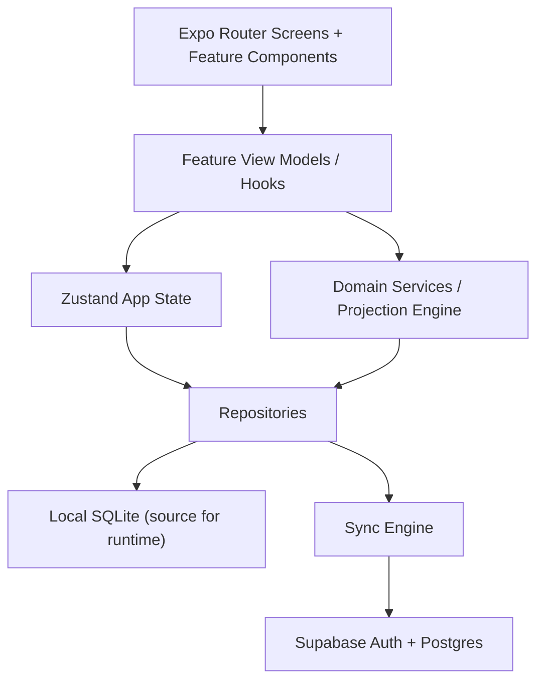

# System Design – Aura Mobile

## 1. Objetivo

Definir a arquitetura técnica ideal para o Aura como um app mobile de previsibilidade financeira, com alta fidelidade visual à referência, suporte forte a operação offline, sincronização eventual e base sólida para evolução futura.

Constraints obrigatórias:

- `Expo SDK 55`
- `React Native`
- `NativeWind`
- `Supabase`

Decisão principal:

- A V1 será `mobile-first`, `offline-first`, com `Expo Router`, banco local no dispositivo e sincronização assíncrona com Supabase.
- O produto será desenhado para parecer e se comportar como um app nativo, evitando padrões genéricos de CRUD.

---

## 2. Leitura do Produto

O Aura não é um app tradicional de controle financeiro com foco em histórico e categorização. O coração do sistema é:

- projeção diária de saldo;
- injeção automática do diário planejado;
- visualização de risco financeiro em horizonte futuro;
- choque visual como mecanismo de mudança comportamental.

Isso muda a arquitetura.

O sistema não pode tratar tudo como “lista de transações”. Ele precisa separar claramente:

1. fatos já ocorridos;
2. regras e recorrências;
3. projeções calculadas;
4. snapshots derivados para renderização rápida.

Se esses conceitos forem misturados cedo, as telas ficam inconsistentes, o cálculo perde confiabilidade e o produto vira um app de finanças comum.

---

## 3. Princípios Arquiteturais

### 3.1 Offline-first

O usuário precisa conseguir:

- abrir o app instantaneamente;
- lançar movimentações sem internet;
- navegar entre meses sem round-trip ao backend;
- consultar horizonte e totais com resposta local.

Portanto:

- o dispositivo é a fonte operacional imediata;
- o Supabase é a fonte de sincronização e backup de conta;
- conflito é exceção, não fluxo principal.

### 3.2 Domínio antes da UI

As telas dependem do motor matemático. A ordem correta é:

1. modelagem de domínio;
2. engine de projeção;
3. persistência local;
4. sincronização;
5. UI.

### 3.3 UI determinística

As telas devem renderizar a partir de view models derivadas e estáveis, não de lógica espalhada nos componentes.

### 3.4 Regras financeiras explícitas

Regras críticas precisam existir como funções puras e testáveis:

- cálculo da cota diária;
- expansão de recorrência;
- injeção do diário projetado;
- cálculo de saldo acumulado;
- agregações de totais;
- construção do horizonte multi-mês.

---

## 4. Stack Recomendada

## 4.1 App

- `expo@55`
- `react-native`
- `expo-router`
- `typescript`
- `nativewind`
- `react-native-reanimated`
- `react-native-gesture-handler`
- `@gorhom/bottom-sheet`
- `zustand`
- `expo-sqlite`
- `drizzle-orm` com SQLite local
- `@supabase/supabase-js`
- `expo-secure-store`
- `date-fns`
- `zod`
- `flash-list`

## 4.2 Backend e serviços

- `Supabase Auth`
- `Supabase Postgres`
- `Supabase Realtime` apenas se surgir necessidade real
- `Supabase Edge Functions` para jobs ou regras sensíveis futuras
- `Supabase Storage` apenas para assets de perfil/exportações futuras

## 4.3 Qualidade e observabilidade

- `Jest` ou `Vitest` para lógica de domínio
- `Testing Library` para componentes críticos
- `Detox` ou `Maestro` para fluxos E2E depois da base estabilizada
- `Sentry` desde cedo

---

## 5. Decisões-Chave

## 5.1 Expo SDK 55

Expo atende bem este produto porque:

- acelera setup e distribuição;
- suporta navegação moderna com `expo-router`;
- reduz custo de CI/CD;
- entrega acesso suficiente aos módulos nativos necessários;
- mantém caminho aberto para customizações futuras com prebuild.

Não há motivo para começar em bare workflow.

## 5.2 NativeWind

NativeWind é aceitável se usado com disciplina.

Boas práticas obrigatórias:

- tokens centralizados em tema;
- evitar classes arbitrárias espalhadas;
- componentes semânticos para superfície, texto, cards, badges e botões;
- usar `StyleSheet` ou `animated styles` quando performance ou clareza pedir.

NativeWind deve servir ao design system, não substituí-lo.

## 5.3 Supabase

Supabase não deve ser usado como única fonte de leitura em runtime.

Uso correto:

- autenticação;
- sincronização de dados do usuário;
- backup consistente;
- eventuais políticas de acesso e multi-device.

Uso incorreto:

- depender de fetch remoto para abrir a timeline;
- recalcular projeção no servidor a cada navegação;
- usar Realtime como premissa para o funcionamento básico do app.

---

## 6. Arquitetura de Alto Nível



Leitura principal:

- UI conversa com hooks e view models;
- view models usam serviços de domínio;
- repositórios abstraem local e remoto;
- SQLite local responde o app;
- sync engine replica mudanças para Supabase.

---

## 7. Arquitetura em Camadas

```text
app/
  _layout.tsx
  (auth)/
  (tabs)/
  modal/

src/
  core/
    config/
    constants/
    theme/
    utils/
    types/
  domain/
    entities/
    value-objects/
    services/
    rules/
    projections/
  data/
    db/
    schema/
    repositories/
    mappers/
    sync/
  features/
    balances/
    totals/
    transactions/
    tags/
    settings/
    auth/
  components/
    ui/
    layout/
    forms/
  providers/
  stores/
  lib/
```

### Responsabilidades

`app/`

- rotas, layouts e composição das telas.

`src/domain/`

- regra de negócio pura;
- nada de React;
- nada de Supabase;
- nada de componente.

`src/data/`

- banco local;
- schema;
- repositórios;
- sync engine;
- mapeamento entre domínio e persistência.

`src/features/`

- hooks por caso de uso;
- view models;
- componentes específicos de tela;
- coordenação de interações.

`src/components/ui/`

- primitives reutilizáveis e design system.

`src/stores/`

- estado global mínimo e transitório;
- nunca guardar regra de domínio complexa aqui.

---

## 8. Modelo de Domínio

## 8.1 Entidades principais

### UserProfile

- `id`
- `email`
- `displayName`
- `subscriptionStatus`
- `timezone`
- `createdAt`
- `updatedAt`

### AccountSettings

- `id`
- `userId`
- `baseCurrency`
- `initialBalanceCents`
- `monthlyDailyBudgetCents`
- `dailyBudgetMode`
- `projectionMonths`
- `warningThresholdCents`
- `criticalThresholdCents`
- `createdAt`
- `updatedAt`

### Transaction

- `id`
- `userId`
- `type`
- `amountCents`
- `description`
- `effectiveDate`
- `isCleared`
- `notes`
- `createdAt`
- `updatedAt`
- `deletedAt`

### TransactionType

Enum fixo:

- `income`
- `fixed_expense`
- `daily_expense`
- `saving`
- `credit_card`

### RecurrenceRule

- `id`
- `transactionId`
- `frequency`
- `interval`
- `endsAt`
- `dayOfMonth`
- `weekDays`
- `installments`
- `currentInstallment`

### Tag

- `id`
- `userId`
- `name`
- `color`
- `normalizedName`
- `createdAt`
- `updatedAt`
- `deletedAt`

### TransactionTag

- `transactionId`
- `tagId`

### DailyProjection

Entidade derivada, não editável diretamente.

- `date`
- `openingBalanceCents`
- `actualIncomeCents`
- `actualExpenseCents`
- `projectedDailyBudgetCents`
- `closingBalanceCents`
- `riskLevel`

### MonthlySummary

Derivada para aba Totais.

- `month`
- `incomeCents`
- `fixedExpenseCents`
- `dailyExpenseActualCents`
- `savingCents`
- `creditCardCents`
- `dailyProjectedRemainingCents`
- `performanceCents`
- `economizedRatio`
- `costOfLifeCents`
- `dailyAverageActualCents`
- `dailyBudgetTargetCents`

---

## 9. Regra de Ouro do Produto: Real vs Projetado

O sistema deve distinguir:

### Real

- transações lançadas pelo usuário;
- eventos concretos que ocorreram.

### Projetado

- diário automático ainda não consumido;
- recorrências futuras expandidas;
- horizonte previsto com base no saldo atual e regras.

### Snapshot

- materialização local para responder rápido às telas.

Decisão obrigatória:

- `daily projected injection` não é uma `Transaction` comum por padrão;
- ela é calculada pela engine de projeção;
- opcionalmente pode virar lançamento real quando o produto exigir confirmação explícita.

Isso evita:

- duplicação de gastos;
- distorção de relatórios;
- confusão entre o que a pessoa gastou e o que o sistema projetou.

---

## 10. Engine de Projeção Financeira

## 10.1 Inputs da engine

- saldo inicial configurado;
- mês alvo;
- janela futura de projeção;
- transações reais;
- recorrências;
- regra de cota diária;
- cartões/faturas;
- parâmetros de risco.

## 10.2 Pipeline

1. carregar saldo inicial e configurações;
2. carregar transações reais relevantes;
3. expandir recorrências na janela;
4. gerar grade diária por período;
5. calcular cota diária projetada por dia elegível;
6. agregar entradas e saídas do dia;
7. calcular saldo acumulado;
8. classificar risco por cor/faixa;
9. produzir snapshots para `Saldos`, `Totais` e `Horizonte`.

## 10.3 Funções puras obrigatórias

- `expandRecurrences(range, rules)`
- `computeDailyAllowance(settings, monthContext)`
- `buildDailyLedger(range, transactions, projections)`
- `computeRunningBalance(startBalance, dailyLedger)`
- `buildMonthlySummary(month, ledger)`
- `buildBalanceHorizon(months, ledger)`
- `formatCompactCurrency(value)`

## 10.4 Estratégia de performance

Não recalcular tudo em toda renderização.

Usar:

- memoização por intervalo;
- snapshots locais invalidados por eventos;
- recomputação por mês afetado e meses seguintes, não pelo histórico completo sempre.

Regra prática:

- alteração em abril/2026 pode afetar abril em diante;
- não precisa reprocessar janeiro/2026.

---

## 11. Persistência Local

## 11.1 Banco local

Usar `expo-sqlite` com `drizzle-orm`.

Motivos:

- robusto para dados relacionais;
- melhor que AsyncStorage para consultas;
- permite filtros, agregações e índices;
- viável para estratégia offline-first.

## 11.2 Tabelas locais

- `profiles`
- `account_settings`
- `transactions`
- `recurrence_rules`
- `tags`
- `transaction_tags`
- `sync_queue`
- `sync_state`
- `projection_snapshots_daily`
- `projection_snapshots_monthly`

## 11.3 Índices importantes

- `transactions(user_id, effective_date)`
- `transactions(user_id, type, effective_date)`
- `recurrence_rules(transaction_id)`
- `tags(user_id, normalized_name)`
- `projection_snapshots_daily(user_id, date)`

---

## 12. Supabase Design

## 12.1 Escopo do Supabase na V1

- autenticação por e-mail magic link e Apple/Google depois;
- armazenamento da conta do usuário;
- backup e sincronização dos dados financeiros;
- políticas de acesso por `user_id`.

## 12.2 Tabelas remotas

Espelhar o núcleo local:

- `profiles`
- `account_settings`
- `transactions`
- `recurrence_rules`
- `tags`
- `transaction_tags`

Evitar subir snapshots derivados na V1.

O servidor deve persistir dados-fonte, não a renderização calculada, salvo se no futuro houver:

- analytics pesados;
- compartilhamento;
- comparativos multi-device sofisticados.

## 12.3 RLS

Toda tabela com:

- `user_id = auth.uid()`

Regras:

- usuário só lê os próprios dados;
- usuário só grava os próprios dados;
- soft delete para sync confiável.

## 12.4 Autenticação

Fluxo recomendado:

1. app abre com guest local opcional ou onboarding;
2. dados podem nascer localmente antes do login, se o produto quiser reduzir fricção;
3. ao autenticar, faz binding do dataset local ao usuário remoto;
4. sync envia pendências.

Se quiser simplificar V1:

- exigir login antes de persistência remota;
- ainda manter banco local para operação.

---

## 13. Sync Engine

## 13.1 Estratégia

Sincronização assíncrona baseada em fila local.

Cada mutação gera um item em `sync_queue`:

- `entity`
- `entityId`
- `operation`
- `payload`
- `createdAt`
- `retryCount`
- `lastError`

## 13.2 Fluxo

1. usuário salva ação localmente;
2. UI atualiza imediatamente;
3. item entra na fila;
4. worker tenta enviar ao Supabase;
5. em sucesso, marca como sincronizado;
6. em falha, mantém retry exponencial.

## 13.3 Conflitos

Na V1, usar política simples:

- `last write wins` por `updated_at`;
- deletes com soft delete;
- alertar usuário apenas se houver conflito realmente destrutivo.

Como este app tende a ser usado por uma pessoa em um dispositivo, essa estratégia é suficiente no início.

## 13.4 Quando sincronizar

- app foreground;
- reconexão de rede;
- pull-to-refresh manual opcional;
- após mutações críticas;
- background opportunistic sync, sem depender dele.

---

## 14. Navegação

## 14.1 Estrutura

```text
app/
  _layout.tsx
  (auth)/
    login.tsx
    onboarding.tsx
  (tabs)/
    saldos.tsx
    totais.tsx
    tags.tsx
    menu.tsx
    _layout.tsx
  add/
    index.tsx
    amount.tsx
    form.tsx
  horizon/
    index.tsx
  settings/
    daily-forecast.tsx
    profile.tsx
```

## 14.2 Padrão de navegação

- Tabs como navegação primária;
- FAB central customizado no tab layout;
- modal/bottom sheet para fluxo de adição;
- tela separada para `Horizonte de saldos`;
- settings empilhadas por stack.

## 14.3 Observação importante

O botão central não deve ser tratado como aba comum. Ele é uma ação global, não destino de navegação persistente.

---

## 15. Design System

## 15.1 Direção visual

Baseado nas referências:

- fundo quase preto;
- superfícies grafite;
- tipografia forte e alta legibilidade;
- acentos semânticos saturados;
- grids, divisórias e estados opacos muito controlados.

## 15.2 Tokens

### Cores base

- `bg-primary`
- `bg-secondary`
- `bg-elevated`
- `border-subtle`
- `text-primary`
- `text-secondary`
- `text-muted`

### Cores semânticas

- `income-green`
- `expense-orange`
- `daily-pink`
- `saving-lime`
- `card-purple`
- `danger-red`
- `warning-yellow`

## 15.3 Componentes base

- `Screen`
- `HeaderBar`
- `TabBar`
- `FabButton`
- `TypeBadge`
- `CurrencyText`
- `SectionCard`
- `ListRow`
- `TagChip`
- `PrimaryButton`
- `MoneyKeyboard`
- `BottomSheetMenu`

## 15.4 Política de implementação

- componentes primitivos em `components/ui`;
- estilos semânticos primeiro;
- evitar classes Tailwind gigantes dentro das screens;
- qualquer padrão repetido vira componente.

---

## 16. Design das Features

## 16.1 Saldos

Requisitos técnicos:

- rolagem estável;
- cálculo diário rápido;
- alternância entre meses sem fetch remoto;
- renderização com coluna de saldo em destaque.

Implementação:

- `FlashList` ou lista virtualizada;
- item derivado de `DailyProjection`;
- cabeçalho fixo com navegação temporal;
- filtro por tipologia opcional.

## 16.2 Totais

Requisitos:

- cards analíticos simples;
- fórmulas claras;
- forte relação com o método.

Implementação:

- dados vindos de `MonthlySummary`;
- sem gráficos complexos na V1;
- foco em leitura instantânea.

## 16.3 Adicionar

Fluxo em duas etapas:

1. seletor de tipologia;
2. formulário com valor hero e teclado customizado.

Decisões:

- teclado próprio do app;
- formulário com validação `zod`;
- save local imediato;
- haptics nos principais eventos.

## 16.4 Tags

Requisitos:

- busca rápida;
- agregação por mês;
- edição e merge futuros.

Implementação:

- queries locais agregadas;
- tabela relacional `transaction_tags`;
- nomes normalizados para evitar duplicata trivial.

## 16.5 Menu e Configuração

`Previsão de diário` é feature core, não detalhe secundário.

Ela precisa:

- mostrar fórmula;
- permitir edição clara do valor mensal;
- refletir imediatamente em projeções;
- explicar impacto comportamental.

---

## 17. Estado da Aplicação

## 17.1 Zustand deve guardar apenas

- sessão/auth state;
- preferências de UI;
- mês selecionado;
- filtros ativos;
- estado de bottom sheets/modais;
- status de sincronização.

## 17.2 Não guardar em Zustand

- projeção financeira como fonte única;
- dataset principal completo;
- regras de domínio que podem ser derivadas do banco.

Regra:

- banco local é a fonte persistente;
- hooks consultam repositórios e produzem view models;
- Zustand coordena estado transitório.

---

## 18. Estratégia de Segurança

## 18.1 No dispositivo

- tokens em `expo-secure-store`;
- nada sensível em AsyncStorage;
- cuidado com logs em produção;
- limpeza de dados de debug.

## 18.2 No backend

- RLS obrigatória;
- validações de payload;
- soft delete;
- auditoria mínima por `created_at` e `updated_at`.

## 18.3 Privacidade

É dado financeiro pessoal.

Precisa haver:

- política clara de retenção;
- possibilidade futura de exportação;
- possibilidade futura de exclusão da conta e dados.

---

## 19. Performance

## 19.1 Principais riscos

- recalcular horizonte inteiro a cada render;
- lista de saldos com rerender excessivo;
- uso excessivo de classes dinâmicas em NativeWind;
- animações pesadas no bottom sheet e teclado;
- queries locais sem índice.

## 19.2 Mitigações

- snapshots por mês;
- memoização por input hash;
- componentes puros;
- list virtualization;
- reanimated para transições críticas;
- índices em datas e tipos.

## 19.3 Meta de UX

- app útil em menos de 2 segundos após cold start;
- troca de mês percebida como instantânea;
- lançamento salvo em menos de 100 ms localmente.

---

## 20. Testabilidade

## 20.1 Testes obrigatórios da V1

### Domínio

- cálculo de cota diária;
- expansão de recorrência;
- injeção do diário projetado;
- cálculo de performance;
- custo de vida;
- diário médio;
- horizonte futuro.

### Integração

- salvar transação e refletir em snapshots;
- editar configuração do diário e invalidar projeções;
- sync queue criando item corretamente.

### E2E mínimo

- onboarding/login;
- adicionar entrada;
- adicionar diário;
- ver atualização em saldos;
- abrir totais;
- abrir horizonte.

---

## 21. CI/CD

## 21.1 Pipeline mínima

- typecheck
- lint
- tests de domínio
- build de preview

## 21.2 Distribuição

- `EAS Build`
- `EAS Submit` depois
- preview builds internos no início

## 21.3 OTA

`EAS Update` é útil, mas deve ser usado com cuidado em features que alteram schema local. Sempre que houver migração sensível, coordenar com versionamento.

---

## 22. Roadmap Técnico

## Fase 0 – Fundação

- bootstrap Expo SDK 55
- TypeScript
- Expo Router
- NativeWind
- tema e tokens
- Supabase client
- SQLite + Drizzle
- providers base

## Fase 1 – Domínio

- entidades
- schema local/remoto
- engine de projeção
- testes do motor

## Fase 2 – Fluxo principal

- onboarding
- settings iniciais
- Saldos
- Add flow
- Totais

## Fase 3 – Horizonte e tags

- grid de horizonte
- agregação por tags
- busca e edição básica

## Fase 4 – Sync

- auth real
- sync queue
- conflito básico
- backup remoto

## Fase 5 – Endurecimento

- métricas
- sentry
- E2E
- performance pass

---

## 23. Anti-patterns a Evitar

1. Fazer a timeline depender diretamente de queries remotas.
2. Guardar todo o estado financeiro em Zustand.
3. Misturar projeção com lançamento real sem distinção.
4. Espalhar regra financeira em componentes de tela.
5. Usar Supabase como engine de cálculo da V1.
6. Começar com arquitetura complexa de microserviços ou múltiplos backends.
7. Criar design system só depois que a UI já estiver espalhada.

---

## 24. Recomendação Final

A melhor arquitetura para o Aura, respeitando `Expo SDK 55`, `NativeWind` e `Supabase`, é:

- `Expo React Native` com `Expo Router`;
- `offline-first` com `SQLite local + Drizzle`;
- `Supabase` para auth e sync, não para runtime principal;
- `domain-driven frontend` com engine de projeção isolada;
- `NativeWind` guiado por design tokens e componentes semânticos;
- snapshots locais para performance nas telas mais sensíveis.

Essa arquitetura atende o que o produto realmente precisa:

- resposta imediata;
- confiabilidade matemática;
- fidelidade visual;
- evolução segura;
- caminho futuro para multi-device e assinatura.

Se a execução seguir essa base, o sistema nasce correto onde mais importa: no domínio e na experiência principal.
